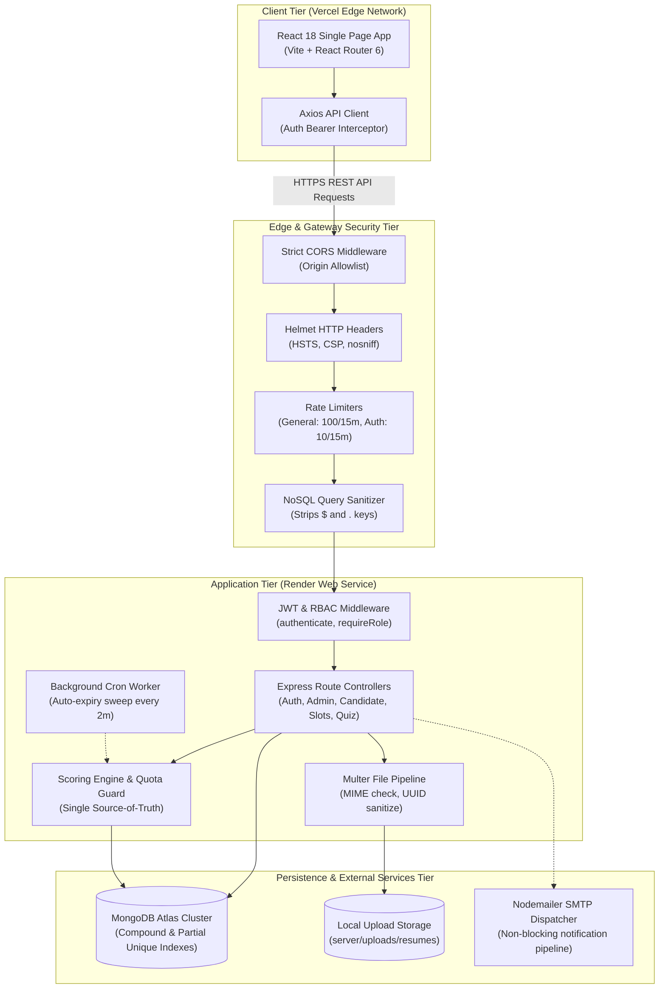
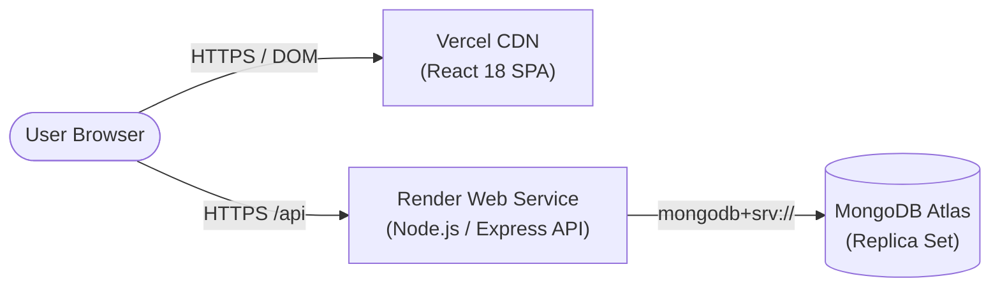

# Smart Interview Scheduler & Mock Assessment Platform (SmartPrep)

[](#testing--quality-assurance)
[](https://smart-interview-scheduler-chi.vercel.app)
[](https://smart-interview-scheduler-api-flgk.onrender.com/health)
[](https://www.mongodb.com/cloud/atlas)
[](#api-documentation-reference)
[](LICENSE)

A production-ready, full-stack platform engineered for mock interview scheduling, timed skill assessments, and comprehensive candidate evaluation. Built with a dual-persona architecture serving both job candidates and platform administrators, the system features atomic concurrency controls to eliminate double-bookings, an automated assessment engine with synchronized countdown timers and server-side answer protection, role-based access control (RBAC), non-blocking email notifications, and real-time operational telemetry.

---

## 🌐 Live Production Deployments

- **Frontend Application (Vercel CDN)**: [https://smart-interview-scheduler-chi.vercel.app](https://smart-interview-scheduler-chi.vercel.app)
- **Backend API Health Check (Render)**: [https://smart-interview-scheduler-api-flgk.onrender.com/health](https://smart-interview-scheduler-api-flgk.onrender.com/health)
- **API Base URL**: `https://smart-interview-scheduler-api-flgk.onrender.com/api`

> [!NOTE]
> The backend is hosted on Render's free tier. If the service has been idle, the initial request may experience a 30–60 second cold start while the container spins up. Subsequent requests respond with sub-second operational latency.

---

## 📋 Table of Contents

1. [Project Overview](#project-overview)
2. [Architecture & System Design](#architecture--system-design)
3. [Implemented & Verified Features](#implemented--verified-features)
   - [Authentication & Security Hardening](#1-authentication--security-hardening)
   - [Candidate Experience & Workflows](#2-candidate-experience--workflows)
   - [Administrator Operations & Studio](#3-administrator-operations--studio)
   - [Automated Scoring & Concurrency Controls](#4-automated-scoring--concurrency-controls)
   - [Communications & Background Tasks](#5-communications--background-tasks)
4. [Technology Stack](#technology-stack)
5. [Local Development Setup](#local-development-setup)
6. [Testing & Quality Assurance](#testing--quality-assurance)
7. [Production Deployment Guide](#production-deployment-guide)
8. [Screenshots & UI Walkthrough](#screenshots--ui-walkthrough)
9. [API Documentation Reference](#api-documentation-reference)
10. [Future Enhancements](#future-enhancements)

---

## 📖 Project Overview

Preparing for technical interviews requires both real-time interpersonal practice and rigorous skill assessments. Traditional scheduling workflows frequently suffer from calendar synchronization friction, race conditions during high-demand booking windows, and compromised assessment integrity due to client-side scoring or leaked answer keys.

**SmartPrep** resolves these challenges through an end-to-end engineered web application:

- **For Candidates**: Search and reserve mock interview slots with verified interviewers, manage professional profiles with resume file attachments, take synchronized timed assessments across technical disciplines, and review detailed pass/fail analytics with topic-by-topic mastery breakdowns.
- **For Administrators**: Publish and manage interview availability with mathematical overlap prevention, curate assessment question banks with marking schemes and explanations, monitor candidate attempt histories, conduct targeted or platform-wide broadcast announcements, and track real-time platform KPIs on a unified operations dashboard.

Every workflow is backed by automated tests, strict database constraints, and defense-in-depth security policies.

---

## 🏗️ Architecture & System Design

The application follows a decoupled client-server architecture utilizing **React 18** on the presentation layer, an **Express/Node.js** RESTful API gateway on the application layer, and a cloud **MongoDB Atlas** cluster for persistence.



### Architectural Highlights

1. **Atomic Concurrency Controls**: Interview slot bookings utilize MongoDB atomic update operations (`findOneAndUpdate` with `$expr` comparison comparing `$bookedCount` against `$capacity`). This eliminates race conditions and guarantees that concurrent reservation requests never overbook available seats.
2. **Synchronized Assessment Clock**: To counter client device clock skew or local clock tampering, assessment duration timers synchronize against the server's authoritative HTTP `Date` header upon initialization, computing exact remaining seconds and triggering automated submission when time expires.
3. **Dual Defense-in-Depth Answer Key Secrecy**: Candidate assessment discovery and taking endpoints strictly strip `correctOptionIndex` and `explanation` via both Mongoose projection exclusions (`.select('-correctOptionIndex -explanation')`) and in-memory object sanitization. Answer keys are strictly inaccessible outside administrator-authorized endpoints.
4. **Single Source-of-Truth Scoring Engine**: All exam scoring (whether triggered by candidate manual submission, on-access expiry evaluation, or background cron sweeps) runs through a centralized scoring service that evaluates answers against authoritative database questions, normalizes out-of-range option indices, dynamically computes percentages, and checks passing criteria.
5. **Reverse Proxy Trust & Rate Limiting**: Deployed behind PaaS reverse proxies (Render), the Express application configures `trust proxy: 1` to resolve real client IP addresses from `X-Forwarded-For` headers, enforcing strict brute-force protection (10 attempts / 15 min) on authentication routes without false-positive lockouts.

---

## ⚡ Implemented & Verified Features

All features listed below are **100% implemented, verified by automated test suites, and operational in production**.

### 1. Authentication & Security Hardening
- **JWT Session Management**: Stateless authentication using JSON Web Tokens transmitted strictly via standard `Authorization: Bearer <token>` HTTP headers. Tokens passed via URL query parameters are rejected to prevent credential leakage in proxy and server logs.
- **Bcrypt Password Encryption**: Salted password hashing (salt rounds: 10) with pre-save Mongoose hooks. Sensitive fields (`password`, `__v`) are automatically omitted from all JSON and object serializations.
- **Forgot & Reset Password Workflow**: Secure password recovery utilizing cryptographically random SHA-256 tokens with a 15-minute expiration window and single-use lifecycle. Generic responses are returned on forgot-password requests to prevent user enumeration.
- **Authenticated Password Rotation**: Live endpoint (`PUT /api/auth/update-password`) validating current credentials, enforcing min-length rules, and rejecting same-password re-use.
- **Role-Based Access Control (RBAC)**: Distinct permissions for `candidate` and `admin` roles. Administrative endpoints strictly return HTTP 403 Forbidden to candidates, while unauthorized requests return HTTP 401. Account deactivation status (`isActive: false`) is enforced at the authentication barrier.
- **NoSQL Injection Defense**: Recursive sanitization middleware strips keys containing `$` or `.` from request bodies, parameters, and query strings.
- **Defensive HTTP Headers**: Powered by `helmet`, enforcing `Strict-Transport-Security` (HSTS), `X-Content-Type-Options: nosniff`, and `X-Frame-Options: SAMEORIGIN`.

### 2. Candidate Experience & Workflows
- **Interactive Candidate Profile (`/candidate/profile`)**:
  - Full profile management with bio, headline, phone number, location, target role selection (Frontend, Backend, Full Stack, Mobile, Data Scientist/ML Engineer, DevOps, QA/SDET, Other), and social links.
  - Interactive skills manager with custom skill tags.
  - Multi-entry education history manager (degree, institution, graduation year).
  - Dynamic profile completion score calculation updated automatically upon profile edits.
- **Resume File Management (`/candidate/profile/resume`)**:
  - Multi-part resume upload supporting PDF, DOC, and DOCX files up to 5MB.
  - Strict MIME-type checking, UUID filename sanitization, and automatic replacement cleanup (deletes previous file from disk when a new one is uploaded).
  - Secure resume download and deletion endpoints strictly scoped to profile owners and administrators.
- **Interview Discovery & Reservation (`/candidate/slots`, `/candidate/bookings`)**:
  - Discover future available interview slots with keyword search, duration filters (30, 45, 60 minutes), and date range filters.
  - Real-time capacity badges displaying available seats.
  - Atomic booking modal with optional candidate preparation notes.
  - Duplicate booking guard preventing candidates from holding multiple overlapping active bookings.
  - Self-service booking cancellation with instant slot capacity restoration.
  - Atomic rescheduling allowing candidates to transfer bookings to alternative slots without risk of double-booking or slot loss.
- **Timed Skill Assessments (`/candidate/assessments`, `/candidate/assessments/:id/take`)**:
  - Catalog of published assessments with difficulty levels, time limits, passing scores, and attempt quotas.
  - Active attempt resumption: candidates returning to an active quiz resume their running test without consuming an extra attempt.
  - Timed test arena with a countdown timer synchronized with the server's clock.
  - Interactive question palette with answered/unanswered status indicators.
  - Automatic submission trigger when the timer expires.
- **Results & Performance Analytics (`/candidate/attempts/:id/result`, `/candidate/history`)**:
  - Immediate score report displaying marks obtained, total marks, percentage, pass/fail status, and time taken.
  - Topic-by-topic performance breakdown visualizing strengths and areas for improvement.
  - Chronological historical attempt log with status and score filtering.
  - Aggregate topic mastery analytics compiling performance across all completed tests.
- **Candidate Dashboard & In-App Notifications (`/candidate/dashboard`, `/candidate/notifications`)**:
  - Aggregated KPI cards: profile completion, target role badge, next scheduled interview, recent assessment scores, and pending action items.
  - Notification center with unread count badges, paginated inbox, mark-as-read, and mark-all-read controls.

### 3. Administrator Operations & Studio
- **Executive Operations Dashboard (`/admin/dashboard`)**:
  - Platform-wide telemetry: total registered candidates, scheduled interview volume, published assessment metrics, and platform average pass rates.
  - Mutually-exclusive temporal booking partitioning (`upcoming + completed + cancelled + rescheduled === totalBookings`).
  - Unified, chronological platform activity feed aggregating registrations, bookings, and assessment submissions.
- **Interview Slot Management (`/admin/interview-slots`)**:
  - Create and configure interview availability with date, start/end time, capacity, interviewer name, description, and meeting link.
  - Mathematical overlap prevention engine rejecting overlapping slots for the same interviewer.
  - Cascade slot deletion: cancelling or deleting a slot with active candidate bookings transitions all linked bookings to `cancelled` and dispatches distinct cancellation notices to affected candidates.
  - On-behalf booking management: administrators can reschedule or cancel bookings on a candidate's behalf with full capacity adjustments.
- **Assessment & Question Bank Studio (`/admin/assessments`, `/admin/assessments/:id/questions`)**:
  - Assessment lifecycle management: create, edit, publish/unpublish, and delete assessments.
  - Attempt-aware deletion guard: assessments with existing candidate attempts cannot be deleted, preserving candidate historical records and score reports.
  - Mid-attempt unpublish immunity: candidates actively taking a test when an assessment is unpublished can complete and submit their attempts without disruption.
  - Question Studio: add, edit, and reorder multiple-choice questions with marks allocation, topic categorization, and answer explanations. Correct options are highlighted visually for administrators.
- **Candidate Performance Review (`/admin/results`)**:
  - Cross-collection aggregation joining candidate profiles, user accounts, assessments, and attempt records.
  - Real-time KPI summaries (total attempts, pass rate, average score).
  - Searchable by candidate name, email, or assessment title (with ReDoS-safe regex escaping) and filterable by target role and evaluation outcome.
  - Detailed score report inspection modal displaying question-level responses and topic breakdowns.
- **Candidate Directory & Cascade Deletion (`/admin/candidates`)**:
  - Searchable candidate roster with account status indicators, target role filtering, and resume download access.
  - Candidate 360 view with target role categorization and full attempt/booking audit histories.
  - GDPR-compliant cascade deletion (`DELETE /api/admin/candidates/:id`): atomically removes candidate user records, profiles, resume files from disk, assessment attempts, notifications, and cancels bookings while releasing slot capacities.
- **Broadcast & Notification Center (`/admin/broadcast`)**:
  - System-wide, candidate-wide, or targeted in-app announcement broadcasting.
  - Strict recipient validation: targeted announcements verify that recipient IDs correspond to active candidate accounts.
  - Platform-wide notification audit log with search, type filters, and delivery status tracking.

### 4. Automated Scoring & Concurrency Controls
- **Question-Driven Scoring Engine**: Evaluates candidate responses against database-persisted question records; answers referencing non-existent questions or out-of-range option indices are normalized to unanswered state without crashing.
- **Partial Unique Index Guard**: Single partial unique index on `{ candidateId: 1, assessmentId: 1 }` with `partialFilterExpression: { status: 'in_progress' }`. Strictly limits candidates to at most one active attempt per assessment while allowing unlimited completed and expired historical attempts.
- **Atomic Transition Guard**: Assessment submission utilizes atomic status checks (`findOneAndUpdate({ _id: attemptId, status: 'in_progress' }, ...)`), guaranteeing that duplicate submissions, parallel requests, or concurrent timer sweeps never execute duplicate scoring passes or issue double emails.

### 5. Communications & Background Tasks
- **Non-Blocking Email Dispatcher (`nodemailer`)**:
  - Branded HTML templates for candidate welcome, interview confirmation, rescheduling, cancellation, reminder, and assessment completion.
  - Non-blocking architecture: email dispatches are executed asynchronously without holding up the HTTP response.
  - Built-in simulation fallback: if SMTP environment variables are unconfigured, the application logs a warning and proceeds smoothly without error.
- **Automated Background Expiry Daemon (`node-cron`)**:
  - Background daemon runs every 2 minutes to identify abandoned or expired in-progress assessment attempts.
  - Transitions attempts to `status: 'expired'`, runs the authoritative scoring engine, and issues in-app expiry notifications.

---

## 💻 Technology Stack

| Layer | Technologies | Purpose |
| :--- | :--- | :--- |
| **Frontend SPA** | React 18, Vite | High-performance reactive UI and rapid client build pipeline |
| **Routing & State** | React Router 6, Context API | Client-side routing, protected routes, and session persistence |
| **HTTP Client** | Axios | Request/response interceptors for Bearer tokens and 401 handling |
| **UI Components** | Lucide React, Custom CSS Design System | Responsive grid layouts, accessible UI patterns (focus-visible states, ARIA labels, skip links, semantic HTML), and modals |
| **Backend Runtime** | Node.js (v18+), Express 4 | RESTful API gateway, middleware pipeline, and route handling |
| **Database & ODM** | MongoDB Atlas, Mongoose 8 | Schema modeling, compound indexes, and aggregation pipelines |
| **Security & Auth** | JWT, bcryptjs, Helmet, CORS, Express-Rate-Limit | Token authentication, password hashing, headers, and rate limiting |
| **File Handling** | Multer | Multipart/form-data resume uploads with disk storage |
| **Background Tasks** | node-cron | Periodic sweeps for assessment attempt auto-expiry |
| **Email Services** | Nodemailer | Asynchronous SMTP notifications with HTML templates |
| **API Documentation** | OpenAPI 3.0.3, Swagger UI Express | Standardized API specifications and interactive documentation |
| **Testing** | Jest 29, Supertest, Puppeteer | Unit, integration, security, and headless browser E2E test suites |
| **Hosting & PaaS** | Vercel (Frontend), Render (Backend) | Global edge CDN for SPA, containerized web service for Node.js API |

---

## 🛠️ Local Development Setup

### Prerequisites
- **Node.js**: v18.0.0 or higher
- **npm**: v9.0.0 or higher
- **MongoDB**: Local MongoDB instance (v6.0+) or a free [MongoDB Atlas](https://www.mongodb.com/cloud/atlas) cluster connection URI.

### 1. Clone the Repository
```bash
git clone https://github.com/subhash-1407/Smart-interview-scheduler-and-mock-assessment-platform.git
cd Smart-interview-scheduler-and-mock-assessment-platform
```

### 2. Backend Setup
```bash
# Navigate to backend directory
cd server

# Install dependencies
npm install

# Configure environment variables
cp .env.example .env
```

Open `server/.env` and configure the following required variables:
```env
PORT=5000
NODE_ENV=development
CLIENT_URL=http://localhost:5173
MONGODB_URI=mongodb://localhost:27017/smart_interview_dev
JWT_SECRET=your-minimum-32-character-jwt-secret-key-goes-here
JWT_EXPIRES_IN=7d
MAX_FILE_SIZE_MB=5
ENABLE_SWAGGER=true
```

*(Optional)* Seed an initial administrator account:
```bash
npm run seed:admin
```

Start the backend development server (with nodemon auto-reloading):
```bash
npm run dev
# Backend API listener active at http://localhost:5000
# Swagger API documentation available at http://localhost:5000/api-docs
```

### 3. Frontend Setup
In a separate terminal:
```bash
# Navigate to client directory
cd client

# Install dependencies
npm install

# Configure environment variables
cp .env.example .env
```

Open `client/.env` and verify:
```env
VITE_API_BASE_URL=http://localhost:5000/api
VITE_MAX_FILE_SIZE_MB=5
```

Start the Vite development server:
```bash
npm run dev
# Frontend application active at http://localhost:5173
```

---

## 🧪 Testing & Quality Assurance

The codebase features an exhaustive, multi-tier automated test suite covering unit logic, database transactions, concurrency limits, security vectors, and full multi-persona browser journeys.

### 1. Backend Automated Test Suite (Jest + Supertest)
Run all 24 backend test suites against an in-memory MongoDB runner:
```bash
cd server
npm test -- --runInBand
```
**Current Status**: **286 tests passed across 24 test suites (100% pass rate, 0 open handles)**.

```text
Test Suites: 24 passed, 24 total
Tests:       286 passed, 286 total
Snapshots:   0 total
Time:        19.349 s
```

### 2. Continuous Multi-Persona User Journeys (Puppeteer E2E)
Validates complete 11-step candidate and 9-step admin workflows sequentially against a real backend:
```bash
cd client
npm run verify:journeys:real
```

### 3. Live Production Infrastructure Audit (66 Checks)
Runs automated end-to-end verification against the live deployed Vercel and Render environments:
```bash
cd client
# Run unified live production audit
npm run verify:production
```
- **API & Database Verification (`verify:production:api`)**: 49 / 49 checks passed (Health, CORS, Auth, RBAC, Profile/Resume, Bookings, Assessment Scoring, Notifications, NoSQL Injection, and Clean Teardown).
- **Frontend & Responsiveness Verification (`verify:production:frontend`)**: 17 / 17 checks passed (SPA deep links, mobile/tablet/desktop zero horizontal overflow, and DOM form validation).

---

## 🚀 Production Deployment Guide

### Architecture Overview
- **Frontend SPA**: Hosted on **Vercel** with global edge caching and SPA fallback rewrites.
- **Backend API**: Hosted on **Render** as a containerized Node.js Web Service.
- **Database**: Cloud-hosted **MongoDB Atlas** M0/M10 replica set cluster.



### 1. MongoDB Atlas Configuration
1. Create a cluster on [MongoDB Atlas](https://www.mongodb.com/cloud/atlas).
2. Under **Network Access**, add IP `0.0.0.0/0` (Allow access from anywhere) to allow dynamic outbound IPs from Render to connect.
3. Under **Database Access**, create a database user and record the connection string (`mongodb+srv://...`).

### 2. Backend Deployment (Render)
1. In the [Render Dashboard](https://dashboard.render.com), create a new **Web Service** pointing to your Git repository.
2. Configure service settings:
   - **Root Directory**: `server`
   - **Runtime**: `Node`
   - **Build Command**: `npm install`
   - **Start Command**: `npm start`
   - **Health Check Path**: `/health`
3. Configure Environment Variables in Render:
   - `NODE_ENV` = `production`
   - `CLIENT_URL` = `https://smart-interview-scheduler-chi.vercel.app`
   - `MONGODB_URI` = `<your-mongodb-atlas-uri>`
   - `JWT_SECRET` = `<cryptographically-secure-random-32+-char-string>`
   - `JWT_EXPIRES_IN` = `7d`
   - `MAX_FILE_SIZE_MB` = `5`
   - `ADMIN_DEFAULT_PASSWORD` = `<your-secure-admin-password>`
   - `ENABLE_SWAGGER` = `false`

### 3. Frontend Deployment (Vercel)
1. In the [Vercel Dashboard](https://vercel.com), import your Git repository.
2. Configure project settings:
   - **Framework Preset**: `Vite`
   - **Root Directory**: `client`
   - **Build Command**: `npm run build`
   - **Output Directory**: `dist`
3. Configure Environment Variables in Vercel:
   - `VITE_API_BASE_URL` = `https://smart-interview-scheduler-api-flgk.onrender.com/api`
   - `VITE_MAX_FILE_SIZE_MB` = `5`
4. Deploy the application. SPA deep-linking and browser refreshes are handled automatically via [`client/vercel.json`](file:///c:/Users/SUBHASH/OneDrive/Desktop/Project%20smart/client/vercel.json).

---

## 📸 Screenshots & UI Walkthrough

| Screen | Description | Placeholder / Mockup |
| :--- | :--- | :---: |
| **Candidate Dashboard** | Key metrics, upcoming scheduled interviews, recent assessment scores, and action alerts. | *`[ Screenshot: Candidate Dashboard (/candidate/dashboard) ]`* |
| **Mock Interview Booking** | Available slot discovery with keyword and duration filters, capacity badges, and booking modal. | *`[ Screenshot: Available Slots (/candidate/slots) ]`* |
| **Timed Assessment Arena** | Active assessment interface featuring live server-synchronized countdown timer and question palette. | *`[ Screenshot: Assessment Arena (/candidate/assessments/:id/take) ]`* |
| **Assessment Score Report** | Detailed outcome summary displaying pass/fail status, accuracy metrics, and topic-wise mastery cards. | *`[ Screenshot: Attempt Results (/candidate/attempts/:id/result) ]`* |
| **Admin Operations Dashboard** | Platform KPI overview, temporal interview state distribution, and unified activity feed. | *`[ Screenshot: Admin Operations Dashboard (/admin/dashboard) ]`* |
| **Question Bank Studio** | Question authoring studio with option management, visual answer key designation, and explanations. | *`[ Screenshot: Question Studio (/admin/assessments/:id/questions) ]`* |
| **Candidate Results & Analytics** | Aggregated results table with filterable search and full candidate attempt score inspection modal. | *`[ Screenshot: Admin Candidate Results (/admin/results) ]`* |
| **Broadcast & Notification Center** | Operations broadcast panel with flexible audience targeting and platform notification audit logs. | *`[ Screenshot: Broadcast Center (/admin/broadcast) ]`* |

---

## 📡 API Documentation Reference

The backend implements a comprehensive OpenAPI 3.0.3 specification covering all 37 endpoint paths and 50 operations. When enabled (`ENABLE_SWAGGER=true` or in development mode), interactive Swagger documentation is accessible at:

- **Interactive Swagger UI**: [http://localhost:5000/api-docs](http://localhost:5000/api-docs)
- **Raw OpenAPI 3.0.3 Spec**: [http://localhost:5000/api-docs.json](http://localhost:5000/api-docs.json)

### Core Endpoint Summary

| Domain | Method | Endpoint | Access | Purpose |
| :--- | :---: | :--- | :---: | :--- |
| **Auth** | `POST` | `/api/auth/register` | Public | Register new candidate account (immutable candidate role) |
| **Auth** | `POST` | `/api/auth/login` | Public | Authenticate user, returns JWT (rate limited: 10/15m) |
| **Auth** | `POST` | `/api/auth/logout` | Authenticated | Terminate session and invalidate client token |
| **Auth** | `GET` | `/api/auth/me` | Authenticated | Retrieve authenticated user profile and role |
| **Auth** | `POST` | `/api/auth/forgot-password`| Public | Initiate password reset token generation |
| **Auth** | `POST` | `/api/auth/reset-password/:token` | Public | Reset password using valid reset token |
| **Auth** | `PUT` | `/api/auth/update-password`| Authenticated | Rotate account password |
| **Candidate**| `GET` | `/api/candidate/dashboard` | Candidate | Consolidated candidate metrics, upcoming slot, and notifications |
| **Candidate**| `GET` | `/api/candidate/profile` | Candidate | Retrieve personal profile and calculated completion score |
| **Candidate**| `PUT` | `/api/candidate/profile` | Candidate | Update profile details and skills |
| **Candidate**| `POST` | `/api/candidate/profile/resume` | Candidate | Upload resume document (PDF/DOC/DOCX up to 5MB) |
| **Candidate**| `GET` | `/api/candidate/profile/resume` | Candidate / Admin | Download stored candidate resume file |
| **Candidate**| `DELETE`| `/api/candidate/profile/resume` | Candidate | Remove uploaded resume file from disk |
| **Candidate**| `POST` | `/api/candidate/bookings` | Candidate | Atomically reserve available interview slot |
| **Candidate**| `GET` | `/api/candidate/bookings` | Candidate | List personal interview booking history |
| **Candidate**| `PATCH`| `/api/candidate/bookings/:id/cancel` | Candidate | Cancel personal booking and restore slot capacity |
| **Candidate**| `PATCH`| `/api/candidate/bookings/:id/reschedule` | Candidate | Atomically transfer booking to another available slot |
| **Candidate**| `POST` | `/api/candidate/assessments/:id/start` | Candidate | Start new attempt or resume active in-progress assessment |
| **Candidate**| `POST` | `/api/candidate/attempts/:id/submit` | Candidate | Submit assessment answers for automated scoring |
| **Candidate**| `GET` | `/api/candidate/attempts/:id/result` | Candidate | Detailed score report with topic-wise accuracy |
| **Candidate**| `GET` | `/api/candidate/assessments/history` | Candidate | Historical log of completed and expired attempts |
| **Candidate**| `GET` | `/api/candidate/performance/topic-wise` | Candidate | Aggregated topic mastery breakdown |
| **Admin** | `GET` | `/api/admin/dashboard` | Admin | Platform-wide KPI metrics and chronological activity feed |
| **Admin** | `GET` | `/api/admin/candidates` | Admin | Search and filter registered candidates |
| **Admin** | `DELETE`| `/api/admin/candidates/:id` | Admin | Cascade delete candidate and all associated data |
| **Admin** | `POST` | `/api/admin/interview-slots` | Admin | Create interview slot with overlap prevention |
| **Admin** | `GET` | `/api/admin/interview-slots` | Admin | List and paginate all scheduled interview slots |
| **Admin** | `DELETE`| `/api/admin/interview-slots/:id` | Admin | Delete/cancel slot and cascade-cancel active bookings |
| **Admin** | `GET` | `/api/admin/bookings` | Admin | Search and inspect platform bookings |
| **Admin** | `PATCH`| `/api/admin/bookings/:id/reschedule` | Admin | Atomically reschedule booking on candidate's behalf |
| **Admin** | `POST` | `/api/admin/assessments` | Admin | Create skill assessment |
| **Admin** | `PATCH`| `/api/admin/assessments/:id/publish` | Admin | Toggle assessment published state |
| **Admin** | `DELETE`| `/api/admin/assessments/:id` | Admin | Attempt-guarded assessment deletion |
| **Admin** | `POST` | `/api/admin/assessments/:id/questions` | Admin | Add question with answer key and explanation |
| **Admin** | `GET` | `/api/admin/results` | Admin | Cross-collection candidate attempt performance table |
| **Admin** | `POST` | `/api/admin/notifications/broadcast` | Admin | Dispatch targeted or platform-wide announcement |
| **Discovery**| `GET` | `/api/interview-slots` | Public | Discover upcoming open interview slots |
| **Discovery**| `GET` | `/api/assessments` | Public | Discover published skill assessments |
| **Discovery**| `GET` | `/api/assessments/:id/questions` | Public | Retrieve quiz questions with answer keys stripped |
| **Inbox** | `GET` | `/api/notifications` | Authenticated | Paginated user notifications with unread counter |
| **Inbox** | `PATCH`| `/api/notifications/:id/read` | Authenticated | Mark specific notification as read |
| **Inbox** | `PATCH`| `/api/notifications/read-all` | Authenticated | Mark all notifications as read |
| **System** | `GET` | `/health` | Public | Unauthenticated platform health and uptime probe |

---

## 🔮 Future Enhancements

While all core requirements and operational workflows are fully implemented and verified in production, the following architectural enhancements represent natural directions for future iterations:

1. **Cloud Object Storage for Resumes**:
   - *Current State*: Resumes are stored on local disk via Multer (`server/uploads/resumes`). On free/ephemeral cloud tiers (Render free dynos), files do not persist across redeployments.
   - *Future Plan*: Integrate AWS S3 or Cloudinary using `multer-s3` to provide persistent, scalable cloud storage regardless of hosting tier.
2. **In-App WebRTC Video Interview Rooms**:
   - *Current State*: Interview slots provide custom meeting links (e.g. Google Meet, Zoom).
   - *Future Plan*: Embed native WebRTC or Daily.co peer-to-peer video rooms directly inside the candidate and interviewer dashboard interfaces.
3. **AI-Powered Question Bank Generation**:
   - *Current State*: Administrators manually author questions, options, and explanations in the Question Studio.
   - *Future Plan*: Connect with Google Gemini API to generate contextual multiple-choice questions, code snippets, and grading rubrics from job descriptions or skill topics.
4. **Automated Calendar Synchronization**:
   - *Current State*: Bookings trigger in-app notifications and SMTP emails with calendar details.
   - *Future Plan*: Generate two-way synchronized Google Calendar and Outlook events via OAuth 2.0 or downloadable `.ics` calendar attachments.
5. **Dark Mode Theme Support**:
   - *Current State*: Unified clean, accessible light design system with focus-visible states and semantic HTML.
   - *Future Plan*: Implement a CSS variable-driven dark theme with system preference detection and local toggle persistence.
6. **Role-Specific Assessment & Slot Matching & Resume Auto-Detection**:
   - *Current State*: Candidates select an optional `targetRole` (Frontend, Backend, Full Stack, Mobile, Data Scientist/ML Engineer, DevOps, QA/SDET, Other) on their profile, which is surfaced across candidate dashboards and admin search/filter tools. Assessments and interview slots remain general/skill-based.
   - *Future Plan*: Tag assessment modules and interview slots with target roles to provide personalized recommendation feeds for candidates, and integrate AI resume parsing to automatically detect and suggest the candidate's target role upon PDF upload.

---

## 📄 License

This project is licensed under the MIT License. See the [LICENSE](LICENSE) file for details.
